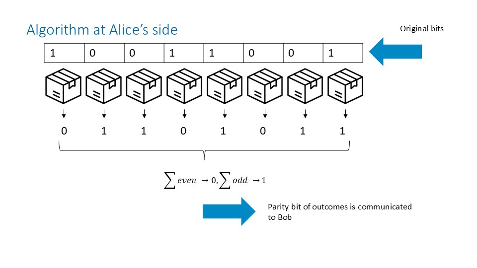
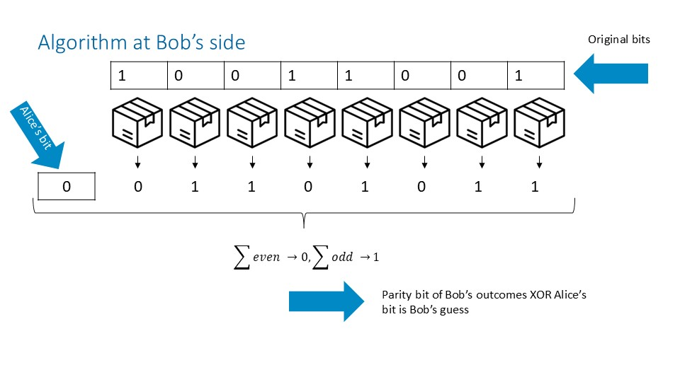

# Linear Algorithm 

## Overview

The **linear algorithm** is a classical assisted strategy for random access codes (RACs) based on **parity (XOR) encoding and decoding**. The linear algorithm relies on a shared resource and defines the measurement stragegy for this shared resources, as well as the interpretation of the outcomes.

In QSeaBattle, the linear algorithm is implemented as a **teacher strategy** that generates supervised imitation targets for trainable models. The implementation is inspired by the linear inner-product–based constructions discussed by **van Dam** in his work on communication complexity and nonlocal correlations.

## Conceptual Background (van Dam)

Van Dam shows that Boolean functions can be expressed as sums of products over $\{0,1\}$, i.e. linear combinations modulo 2, and that distributed parties with access to shared resources can evaluate inner products efficiently by exchanging a single bit. In this view, linear RAC strategies encode information in **parity bits**, and decoding consists of XOR-ing communicated bits with locally computed parities.

In the language of van Dam, Alice and Bob share a distributed system $\Phi_{AB}$ that produces correlated outcomes based on their local measurement choices. In QSeaBattle, this role is played by a **shared-resource layer** (`PRAssistedLayer`) that mediates correlations between Alice’s and Bob’s measurements.

## The Linear Algorithm – Encoding & Decoding (as Implemented)

### State and notation

- Let $n^2 = \texttt{field\_size}^2$ be the number of field bits.
- Alice’s input field is $x \in \{0,1\}^{n^2}$.
- Bob’s index state is represented by a one-hot **gun** vector $g \in \{0,1\}^{n^2}$.
- Alice sends a communication vector $c \in \{0,1\}^m$.
- Alice and Bob share a distributed resource $\Phi_{AB}$ producing outcome vectors in $\{0,1\}^{n^2}$.
- All additions are modulo 2 (XOR).

### Alice side (Model A)

#### Measurement A (identity measurement)

Alice’s measurement is linear and trivial: each measurement outcome equals the corresponding field bit,
$$
m_i^{(A)} = x_i.
$$

#### Shared-resource interaction (first measurement)

The measurement vector $m^{(A)}$ is passed to *her part* of the shared resource $\Phi_{AB}$ as the **current measurement**. Since this is the first interaction with the shared resource, the previous measurement and outcome are set to zero, and a `first_measurement` flag is raised.

The shared resource produces an outcome vector
$$
o^{(A)} \in \{0,1\}^{n^2}.
$$

#### Combine A (communication generation)

Alice computes the **parity** of all shared-resource outcomes,
$$
p^{(A)} = \bigoplus_{i=1}^{n^2} o^{(A)}_i.
$$

This single parity bit is then replicated to form the communication vector:
$$
c = (p^{(A)}, p^{(A)}, \dots, p^{(A)}) \in \{0,1\}^m.
$$

### Bob side (Model B)

#### Measurement B (identity measurement on the gun)

Bob’s measurement is also linear and identity-like:
$$
m_i^{(B)} = g_i.
$$

#### Shared-resource interaction (second measurement)

Bob feeds his measurement $m^{(B)}$ into the *his part* of the same shared resource $\Phi_{AB}$, together with Alice’s previous measurement and outcome. The `first_measurement` flag is now unset.

The shared resource produces a second outcome vector
$$
o^{(B)} \in \{0,1\}^{n^2}.
$$

#### Combine B (final decision)

Bob computes:
- the parity of his shared-resource outcomes,
$$
p^{(B)} = \bigoplus_{i=1}^{n2} o^{(B)}_i,
$$
- the parity of the received communication vector,
$$
p^{(c)} = \bigoplus_{j=1}^{m} c_j.
$$

The final output (shoot decision) is
$$
\text{shoot} = p^{(B)} \oplus p^{(c)}.
$$

## Interpretation

Operationally, the algorithm realizes the following idea:

- Alice encodes global information about her input field into a **single parity bit**, mediated by shared-resource correlations.
- Bob combines this communicated parity with his own parity, derived from the shared resource and his index, to recover the desired bit.

## Conditions and Limitations

- The algorithm is **not claimed to be optimal** for classical RACs.
- Correctness and performance depend on:
  - uniform input distributions,
  - noiseless classical communication,
  - the behavior of the shared-resource layer.
- The shared resource affects only the parity values and does not alter the gun or field states.
- The strategy serves as a **baseline teacher** for imitation learning, not as a physical or information-theoretic bound.

## QSeaBattle implementation notes

- The algorithm is implemented across:
  - `LinTrainableAssistedModelA`,
  - `LinTrainableAssistedModelB`,
  - dataset generators in `lin_trainable_assisted_imitation_utilities.py`.
- Measurement layers implement identity mappings.
- Combine layers implement parity (XOR-reduction) logic.
- The shared-resource layer corresponds conceptually to van Dam’s distributed system $\Phi_{AB}$.

## Key References

- **W. van Dam**, *Implausible Consequences of Superstrong Nonlocality*, arXiv:quant-ph/0501159.
- **W. van Dam**, *Nonlocality & Communication Complexity*, D.Phil. thesis, University of Oxford, Chapter 9.
